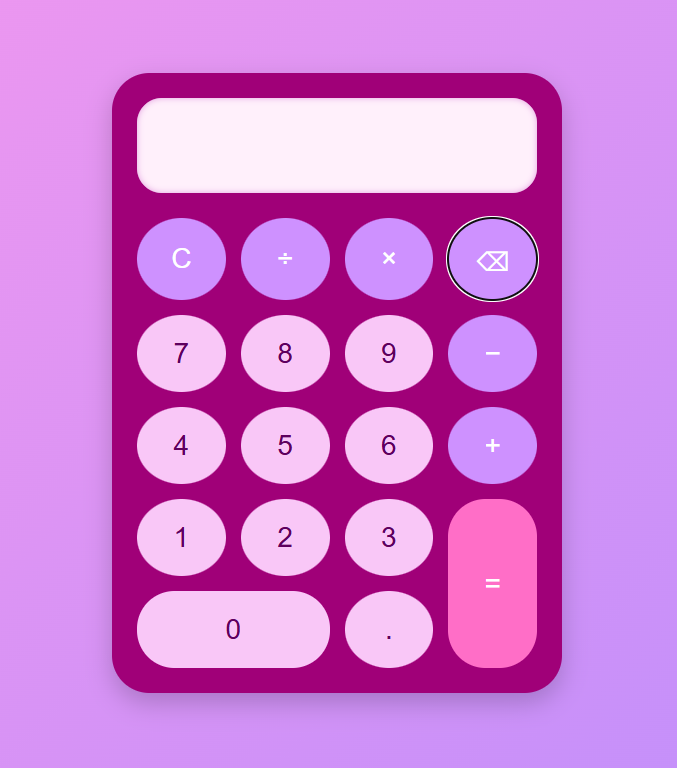

# Pink & Purple Calculator

A stylish and mobile-responsive calculator built using **HTML**, **CSS**, and **JavaScript**. This simple app performs basic arithmetic operations and looks great on both desktop and mobile!

## Some Basic Features
- Performs basic operations: `+`, `−`, `×`, `÷`
- Clear (C), backspace (⌫), and decimal support

## Preview

## File Structure

This is a simple file structure:

CalculatorApp/
├── app/
│   ├── index.html
│   ├── index.css
│   └── app.js
├── images/
│   └── (images used)
└── README.md

## Author

Developed by: Clyde Rubian
Date of Developement: 25th of July 2025