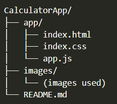

# Pink & Purple Calculator

A stylish and mobile-responsive calculator built using **HTML**, **CSS**, and **JavaScript**. This simple app performs basic arithmetic operations and looks great on both desktop and mobile!

## Some Basic Features
- Performs basic operations: `+`, `−`, `×`, `÷`
- Clear (C), backspace (⌫), and decimal support

## Preview

## File Structure

This is a simple file structure:

## Deployment

Check out the deployed web app through this link: https://kuhlayd02.github.io/CalculatorApp/ 

## Author

- Developed by: Clyde Rubian
- Date of Developement: 25th of July 2025